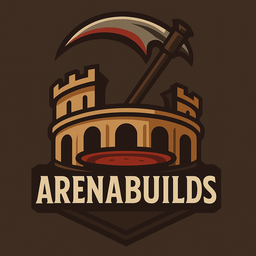

# ArenaBuilds

**ArenaBuilds** is a lightweight, server-side mod for *V Rising* that allows players to instantly equip ready-to-use PvP builds via simple in-game commands.
It’s designed to streamline arena practice and fast-paced duels without the need to manually gear up.

Although this mod is primarily designed for arena use, it can also be leveraged to create highly specialized builds for PvE or other purposes.

---

## 🔧 Features

- Instantly equip a complete build with a single command, including:
  - Blood type
  - Fully attributed weapons
  - Armor sets
  - Abilities
  - Jewels
  - Passive spells
- Default builds are based on PVP_Preset
- Builds are fully customizable via the `builds.json` files
  - A list of valid `prefabName` values is available here: [VRising DB](https://vrising.gaming.tools)
  - For a comprehensive list of prefabName values, particularly those related to StatMod and SpellMod, refer to: [VRising Mods Wiki](https://wiki.vrisingmods.com/prefabs/Spell)
- Dedicated command to create a weapon with personalized attributes

---

## 💬 Commands

| Command                                                              | ShortHand     | Description                                   |
| -------------------------------------------------------------------- | ------------- | --------------------------------------------- |
| `.give_build <class>`                                                | `.giveb`      | Equips the specified build                    |
| `.give_legendary <weapon> <infuse> <statmod1> <statmod2> <statmod3>` | `.giveleg`    | Give legendary weapon                         |
| `.give_artifact <weapon> <statmod1> <statmod2> <statmod3>`           | `.giveart`    | Give artifact weapon                          |
| `.list_build`                                                        | `.listb`      | Displays the list of available builds         |
| `.clear_build`                                                       | `.clearb`     | Clears your inventory, abilities and passives |
| `.unlock_all`                                                        | `.unlock_all` | Unlock abilities, passives...                 |

---

## 📦 Requirements

- [BepInEx](https://github.com/BepInEx/BepInEx)
- [VampireCommandFramework (VCF)](https://github.com/decaprime/VampireCommandFramework)

---

## 📥 Installation

1. **Install BepInEx**  
   Follow the guide here: [BepInEx Installation Guide](https://wiki.vrisingmods.com/user/bepinex_install.html)  

2. **Download VampireCommandFramework (VCF)**  

3. **Download ArenaBuildsMod**  
   Grab the `BuildArena.dll` and `builds.json` files from the [Releases](#) section.

4. **Place the files**  
   
   - Move `VampireCommandFramework.dll` and `BuildArena.dll` to:  
     `BepInEx/Plugins/`
   
   - Move `builds.json` to:  
     `BepInEx/config/ArenaBuilds/`
     
     > Note: The config folder may not exist until you've run the server at least once with BepInEx installed.

---

## 🐞 Known Issues

- The `.clear_build` command does not currently remove jewels. This is not a significant issue, as that functionality has not yet been implemented. 👀

---

## 🚧 Planned Features

- Save and restore your character’s original state before and after using a build.
- Automatically unlock abilities & passives if necessary
- Restrict `.build` usage to specific arena zones (can be toggled via config).
- Load several builds.json.

---

## 🙌 Credits

- Big thanks to the [V Rising Modding Community](https://vrisingmods.com/) for documentation and open-source mods.
- Special thanks to [Odjit](https://github.com/Odjit) for the **KindredExtract** mod, which was a helpful reference.

---

## 👤 Author

Developed by **Crostomos**

Support me on Ko-Fi : https://ko-fi.com/crostomos

---

## 📄 License

This project is licensed under the **AGPL-3.0** license.
